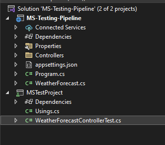

**DevOps Final Assessment**

**Section-1: MCQ**

1\.C

2\.B

3\.B

4\.C

5\.C

6\.B

7\.C

8\.B

9\.C

10\.C

**Section-2: Labs**

**1. Objective:** Practice basic file and directory management commands.

**Tasks:**

1\. Create a directory called "lab1" in your home directory.

2\. Inside "lab1," create a text file named "sample.txt" with some content.

3\. Make a copy of "sample.txt" and name it "sample\_copy.txt."

4\. Rename "sample\_copy.txt" to "new\_sample.txt."

5\. List the files in the "lab1" directory to confirm their names.

**2. Objective:** Understand and manage file permissions and ownership.

**Tasks:**

1\. Create a new file named "secret.txt" in the "lab2" directory.

2\. Set the file permissions to allow read and write access only to the

owner.

3\. Change the owner of "secret.txt" to another user.

4\. Verify the new permissions and owner using the ls -l and ls –n commands.

`           `

**3.** Objective: Practice text processing using command-line tools.

Tasks:

1\. Create a text file with some random text in the "lab3" directory.

2\. Use the grep command to search for a specific word or pattern in the file.

3\. Use the sed command to replace a word or phrase with another in the file.

4\. Use the wc command to count the number of lines, words, and characters in the file.

**4.** Objective: Create a basic YAML configuration file.

Task:

1\. Create a YAML file named "config.yaml."

2\. Define key-value pairs in YAML for a fictitious application, including name, version, and description.

3\. Save the file.

4\. Validate that the YAML file is correctly formatted.

**5.Objective:** Practice working with lists (arrays) in YAML.

**Task:**

1\. Create a YAML file named "fruits.yaml."

2\. Define a list of your favorite fruits using YAML syntax.

3\. Add items from the list.

4\. Save and validate the YAML file.

`                `

`                    `

**6. Objective:** Explore nested structures within YAML.

**Task:**

1\. Create a YAML file named "data.yaml."

2\. Define a nested structure representing a fictitious organization with departments and employees.

3\. Use YAML syntax to add, update, or remove data within the nested structure.

4\. Save and validate the YAML file.

`                    `

`            `

7\.Angular CI with Classic Pipeline. Testing- Jasmine

Above is the sample test in Counter Component

**8**.**React CI with Pipeline. Testing-Enzyme**

`             `

`                     `

**9.DOT-NET CORE WITH MS TEST**

`                                 `

`                      `

**10. Sample .NET project is containerized and that image is running on Rancher Desktop**

`                                            `

` `

`   `

